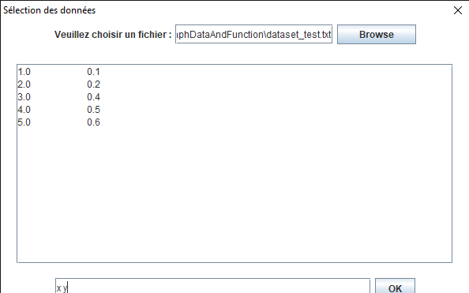
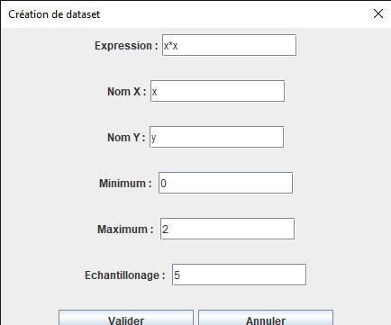
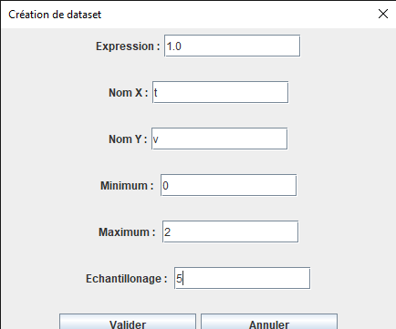
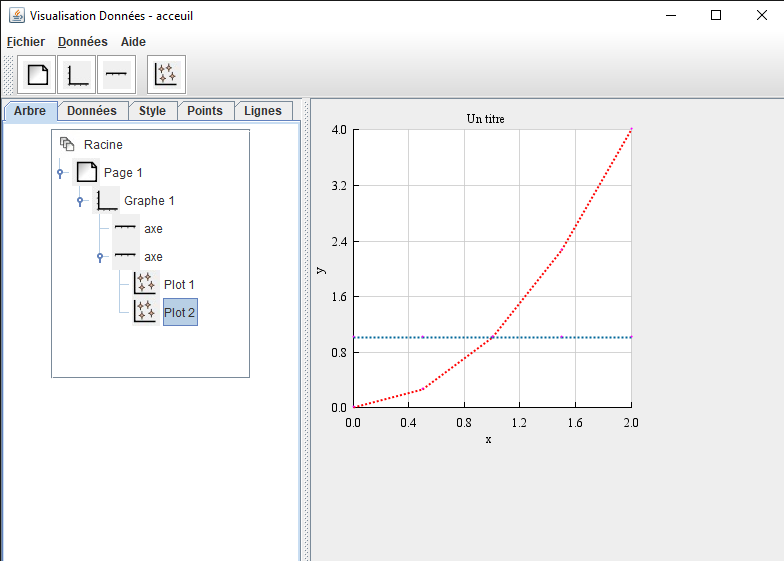
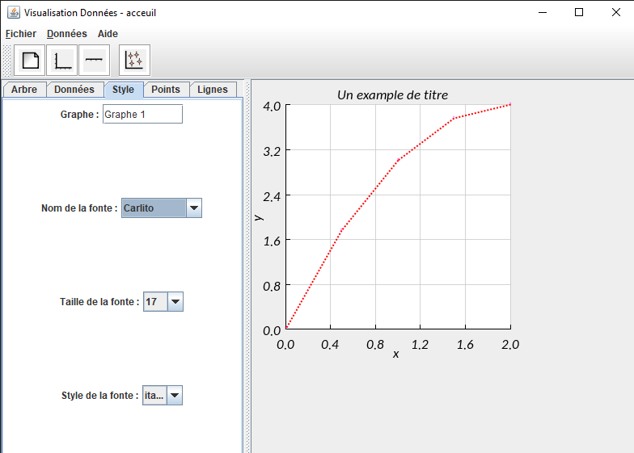

# GraphDataAndFunction application
We tried to emulate the basic feature of a plotting application such as Veusz. There still adjustments to be made to make it fully usable.

## Import a dataset
Go to the tool bar "Données", then select the option "Charger données". A dialog window will open where you can browse to select the data. The data file must be structured like a matrix where to a column corresponds a dataset. The names of the datasets can be given using the following syntax : 
* dataset1 dataset2 ... 

## Create a dataset from scratch
On the "Données" tab, select the "Créer dataset d'une fonction" button. A dialog box will appear with the following field to fill :
* Expression : use the python syntax to enter the function expression with the 'x' variable for instance, be sure to be on the domain of validity of the function.
* Nom X : enter the name of the horizontal axis dataset
* Nom Y : enter the name of the generated dataset
* Minimum : minimum value on the x axis (integer)
* Maximum : maximum value on the x axis (integer)
* Echantillonage : number of points 

## Plot a graph
Go to the "Données" tab, from there select the x and y dataset you want to plot. Go back to the "Arbre" tab and select the graph icon under the right page icon. The click the scattered plot icon on the tool bar. The dataset should be plotted in red by default.
You can add other datasets on the same page. 

## Hide/Show a plot

## Erase a plot   

## Customisation 
There is currently no mean to add legends, but you can differentiate your datasets by changing :
* point styles : size, shape and color can be adjusted on the "Points" tab
* line styles : line type, thickness, end of line and color can be adjusted on the "Lignes" tab

## Title and Fonts 
To change the title and the axis names, be sure to be on the graph node on the tree ("Arbre" tab). Go to the "Styles" tab and select whichever you want. You may need to refresh the field (title and axis name) on the "Données" tab
depending on which order you proceed.

## Scaling 
Go to the graph icon under the page icon on the "Arbre" tab, then "axe X" and "axe Y" can be used :
* "Axe X" let you adjust the scale on the horizontal axis
* "Axe Y" let you adjust the scale on the vertical axis

